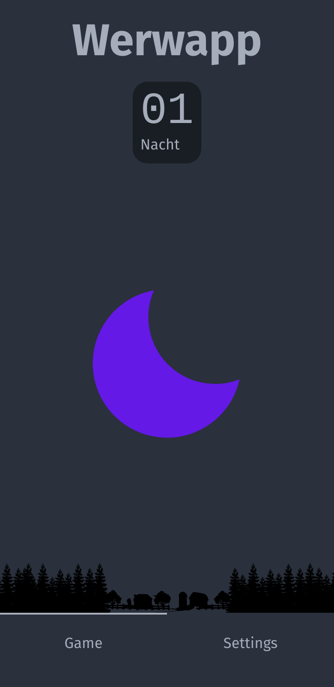

# Werwapp

The unoffical App for the Game _Werwolf_. The app plays differnt songs for each day and night time.

Additional features:

- User selectable themes for day and night
- Counter of the current night
- And more is currently under work

## How can i use this great app?

If you just want to play a round, head over to the [website](https://werwapp.onrender.com).
For local hosting / usage see the development section.

## I need more functionalities

Just create an issue and and describe the feature you wish. We will try our best to implement it.

## I found a bug!

Please create an issue and describe the error by providing reproduction steps and a scrrenshot.

## Develotment

If you want to implement features, fix bugs or just host the website yourself follow theese instructions.

### Setup and start the app

You need the following toolchain:

- NodeJs (16.x)
- Yarn

With that provided, clone the repo and change directory:

`git clone https://github.com/BjarneRentz/werwapp.git`

`cd werwapp`

Install the dependencies

`yarn`

and start the application

`yarn dev`

Thats it now you should see the app under [localhost](http://localhost:5173)

## Contributing

Just fork the repo and start hacking. Please name your commits aber the [convetional commits](https://www.conventionalcommits.org/en/v1.0.0/).
